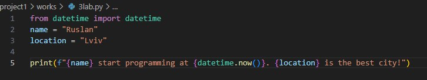
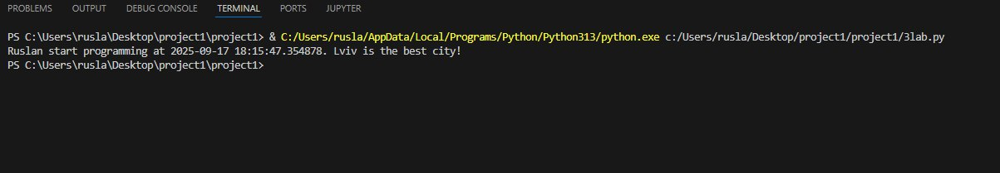
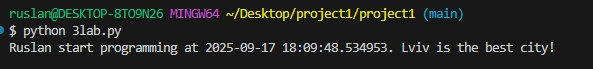
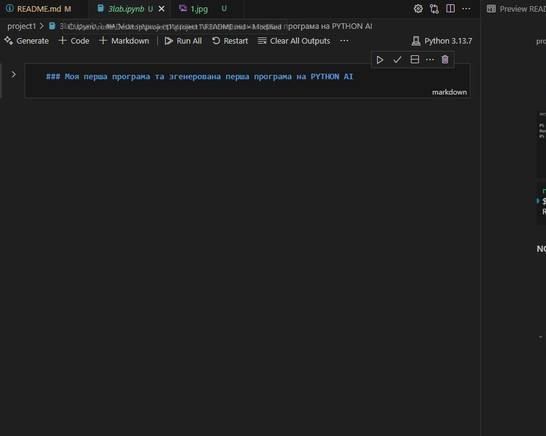
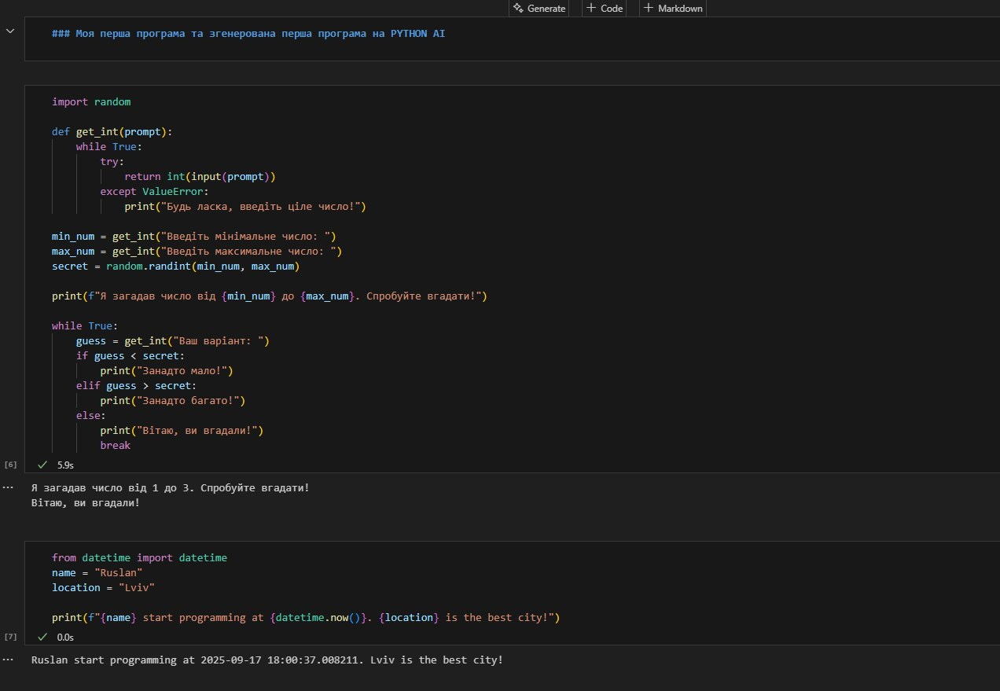

# Звіт до роботи
## Тема: Перша програма на Python
### Мета роботи: Реалізувати та створити першу програму Python

---
### Виконання роботи
#### FIRST PROGRAM ON PYTHON
* 
    1. Написали першу програму на Python
    2. 3lab.py
    3. Ruslan start programming at 2025-09-10 22:34:30.749082. Lviv is the best city!
    4. Навчились створювати файл та запускати код різними способами  
       
       
     
     
     


  #### NOTEBOOK
    1. Створили ноутбук у якому вивели Markdown,Python
    2. 3lab.ipynb
    3. 
    4. Навчились створювати ноутбуки та кодити в них

    


* вставлений код / текстовий або числовий результат / інші результати:
    ```python
    
    1. 
    from datetime import datetime
    name = "Ruslan"
    location = "Lviv"

    print(f"{name} start programming at {datetime.now()}. {location} is the best city!")
    2. 
    import random

    def get_int(prompt):
    while True:
        try:
            return int(input(prompt))
        except ValueError:
            print("Будь ласка, введіть ціле число!")

    min_num = get_int("Введіть мінімальне число: ")
    max_num = get_int("Введіть максимальне число: ")
    secret = random.randint(min_num, max_num)

    print(f"Я загадав число від {min_num} до {max_num}. Спробуйте вгадати!")

    while True:
    guess = get_int("Ваш варіант: ")
    if guess < secret:
        print("Занадто мало!")
    elif guess > secret:
        print("Занадто багато!")
    else:
        print("Вітаю, ви вгадали!")
        break


    ```
    
  
    

---
### Висновок:
> у висновку потрібно відповісти на запитання:

- First program and notebook;
- Yes;
- Дізнався про Markdown.Як ним користуватись.Також дізнався про Notebook і його основи;
- Так;
- Так;
- Ні;
- Так;
- Все на вищому рівні.

---
